# 🎫 Eventix - Ticket Booking System

> A multi-platform ticket booking system enabling event discovery, secure ticket booking, and event management for attendees, organizers, and admins.

[](https://go.dev/)
[](https://www.postgresql.org/)
[](https://redis.io/)
[](LICENSE)

---

## 📋 Table of Contents

- [Overview](#overview)
- [Architecture](#architecture)
- [Tech Stack](#tech-stack)
- [Core Features](#core-features)
- [System Design](#system-design)
- [Database Schema](#database-schema)
- [API Design](#api-design)
- [Project Structure](#project-structure)
- [Getting Started](#getting-started)
- [Security](#security)
- [Performance](#performance)

---

## 🎯 Overview

**Eventix** is a production-grade ticket booking platform designed to solve key pain points in event discovery and ticket management:

- **Event Discovery**: Centralized platform for finding events
- **Secure Booking**: PCI-compliant payment processing with QR-code tickets
- **Real-time Validation**: QR-based check-in with offline support
- **Analytics**: Comprehensive dashboards for organizers
- **Mobile-First**: Optimized mobile experience via React Native/Flutter

### Target Users

| Role | Description |
|------|-------------|
| **Attendees** | Event-goers who browse, book, and manage tickets |
| **Organizers** | Event creators who sell tickets and track analytics |
| **Admins** | Platform operators managing users, events, and payments |

---

## 🏗️ Architecture

### System Architecture

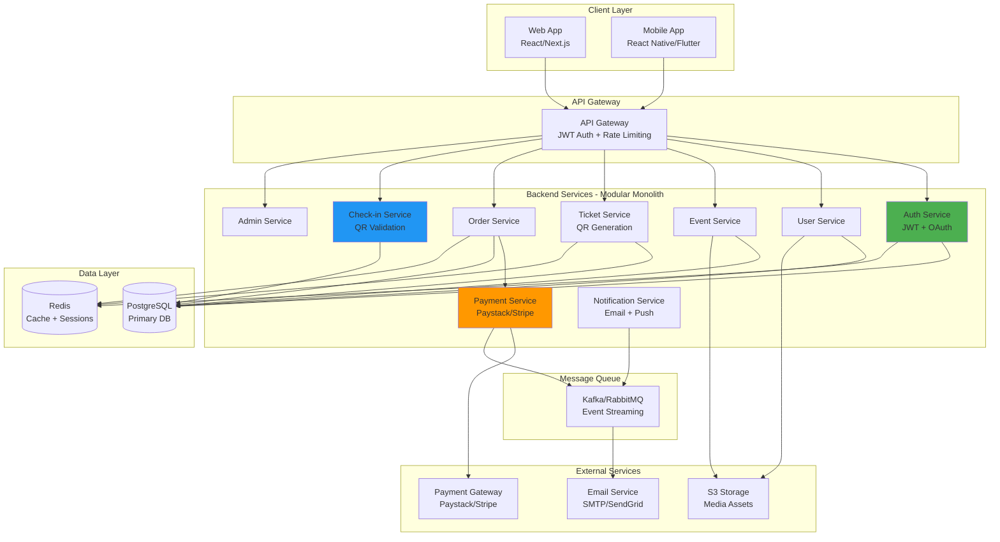

### Architecture Principles

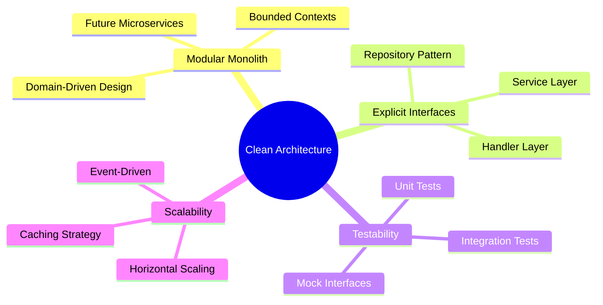

---

## 🛠️ Tech Stack

### Backend Stack

| Layer | Technology | Purpose |
|-------|------------|---------|
| **Language** | Go 1.22+ | High-performance backend |
| **HTTP Framework** | Fiber / net/http | RESTful API |
| **ORM** | GORM / SQLC | Database abstraction |
| **Database** | PostgreSQL | Primary data store |
| **Cache** | Redis | Session & performance |
| **Auth** | JWT + OAuth2 | Authentication & authorization |
| **Message Queue** | Kafka / RabbitMQ | Event streaming |
| **Payments** | Paystack / Stripe | Payment processing |
| **Storage** | S3-compatible | Media storage |
| **Config** | ENV / Doppler | Configuration management |
| **Migrations** | Goose | Database versioning |
| **Observability** | Prometheus + OpenTelemetry | Monitoring & tracing |

### Frontend Stack

| Platform | Technology |
|----------|------------|
| **Web** | React / Next.js |
| **Mobile** | React Native / Flutter |

---

## ✨ Core Features

### For Attendees 🎟️

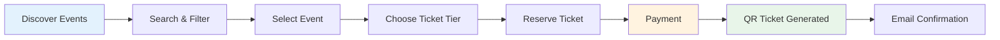

**Features:**
- 🔍 Event discovery & advanced search
- 💳 Secure ticket booking & payment
- 📱 QR-code based digital tickets
- 📜 Booking history & management
- 🔄 Ticket transfers
- 💸 Refund requests
- 🔔 Email & push notifications

### For Organizers 🎪

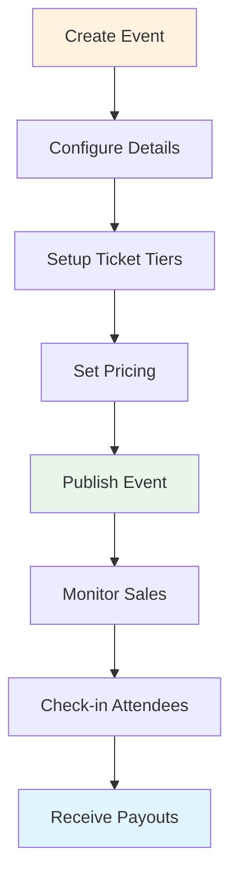

**Features:**
- 📝 Event creation & management
- 🎫 Ticket tier configuration
- 📊 Sales dashboard & analytics
- ✅ Attendee list & check-in
- 💰 Payout management
- 📈 Performance metrics

### For Admin 👨‍💼

**Features:**
- ✓ User & organizer verification
- 🔒 Event moderation & approval
- 💳 Payment oversight
- 📊 Platform metrics & reporting
- 🚫 Ban & suspension controls
- 📋 Audit logs

---

## 🔄 System Design

### Ticket Booking Flow

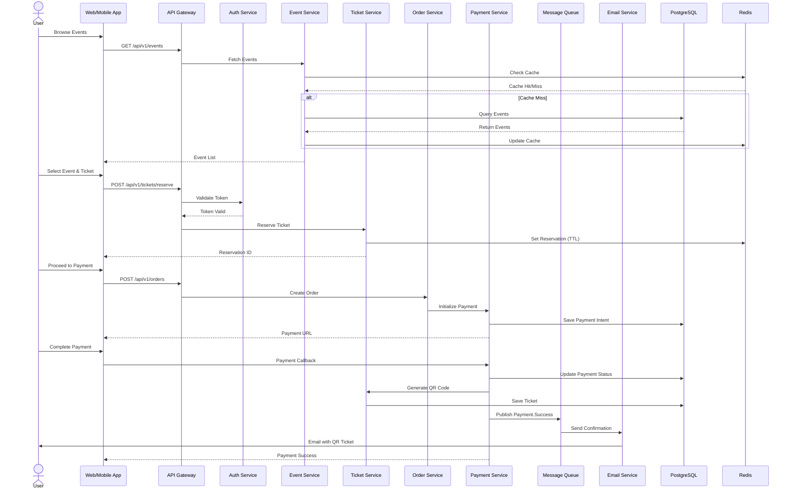

### Check-in Flow

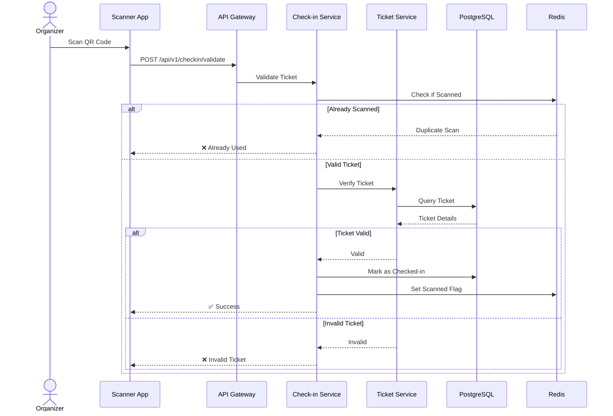

### Payment Processing

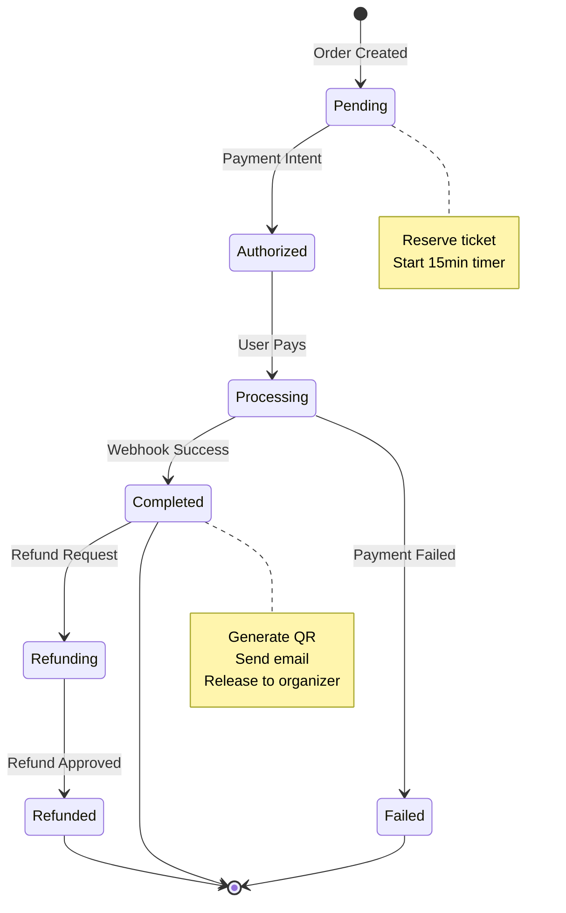

### Event Lifecycle

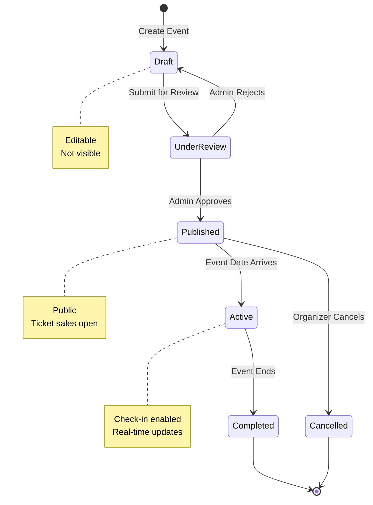

---

## 🗄️ Database Schema

### Core Tables

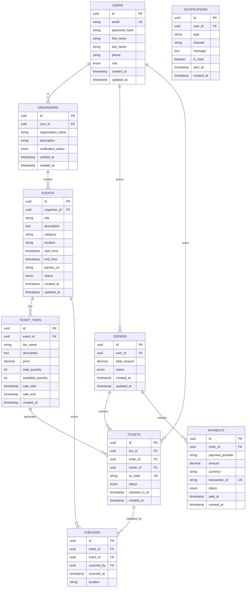

### Database Indexes

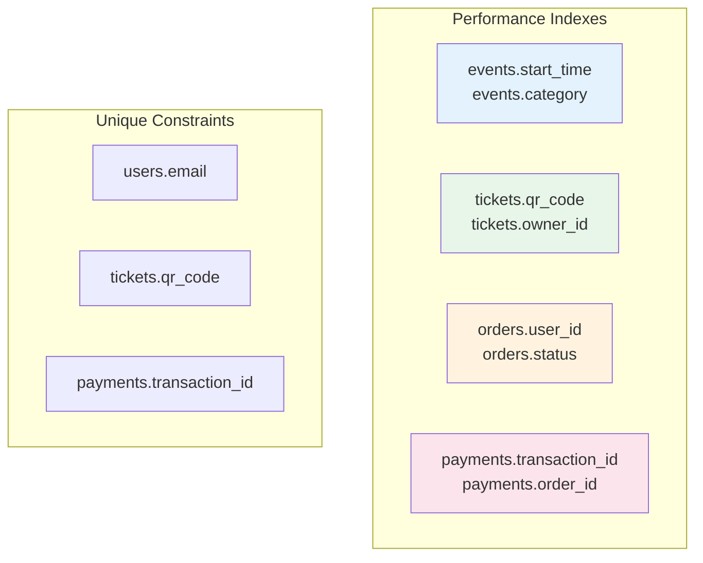

---

## 🌐 API Design

### API Structure

```mermaid
graph LR
    subgraph "API v1"
        A[/api/v1/auth]
        B[/api/v1/users]
        C[/api/v1/events]
        D[/api/v1/tickets]
        E[/api/v1/orders]
        F[/api/v1/payments]
        G[/api/v1/checkin]
        H[/api/v1/admin]
    end
    
    style A fill:#4CAF50
    style F fill:#FF9800
    style G fill:#2196F3
    style H fill:#F44336
```

### Key Endpoints

#### Authentication
```
POST   /api/v1/auth/register          - User registration
POST   /api/v1/auth/login             - User login
POST   /api/v1/auth/refresh           - Refresh token
POST   /api/v1/auth/logout            - Logout
GET    /api/v1/auth/oauth/google      - OAuth login
```

#### Events
```
GET    /api/v1/events                 - List events (paginated)
GET    /api/v1/events/:id             - Get event details
POST   /api/v1/events                 - Create event (organizer)
PUT    /api/v1/events/:id             - Update event (organizer)
DELETE /api/v1/events/:id             - Delete event (organizer)
GET    /api/v1/events/search          - Search events
```

#### Tickets
```
POST   /api/v1/tickets/reserve        - Reserve ticket (15min hold)
GET    /api/v1/tickets/:id            - Get ticket details
POST   /api/v1/tickets/:id/transfer   - Transfer ticket
GET    /api/v1/tickets/my-tickets     - User's tickets
```

#### Orders
```
POST   /api/v1/orders                 - Create order
GET    /api/v1/orders/:id             - Get order details
GET    /api/v1/orders/my-orders       - User's orders
POST   /api/v1/orders/:id/refund      - Request refund
```

#### Check-in
```
POST   /api/v1/checkin/validate       - Validate QR code
GET    /api/v1/checkin/event/:id      - Event check-in stats
```

### Response Format

```json
{
  "success": true,
  "data": {...},
  "message": "Operation successful",
  "timestamp": "2024-01-15T10:30:00Z"
}
```

### Error Format

```json
{
  "success": false,
  "error": {
    "code": "TICKET_NOT_AVAILABLE",
    "message": "Ticket tier sold out",
    "details": {}
  },
  "timestamp": "2024-01-15T10:30:00Z"
}
```

---

## 📁 Project Structure

```
ticketing-backend/
├── cmd/
│   └── api/
│       └── main.go                 # Application entry point
│
├── internal/                        # Private application code
│   ├── auth/                       # Authentication domain
│   │   ├── handler.go              # HTTP handlers
│   │   ├── service.go              # Business logic
│   │   ├── repository.go           # Data access
│   │   └── model.go                # Domain models
│   │
│   ├── users/                      # User management
│   ├── events/                     # Event management
│   ├── tickets/                    # Ticket operations
│   ├── orders/                     # Order processing
│   ├── payments/                   # Payment integration
│   ├── checkin/                    # Check-in system
│   ├── notifications/              # Notification service
│   └── admin/                      # Admin operations
│
├── pkg/                            # Shared packages
│   ├── middleware/                 # HTTP middleware
│   │   ├── auth.go
│   │   ├── ratelimit.go
│   │   └── logger.go
│   ├── database/                   # DB connection
│   ├── cache/                      # Redis client
│   ├── logger/                     # Logging utilities
│   ├── jwt/                        # JWT utilities
│   ├── queue/                      # Message queue
│   └── utils/                      # Helper functions
│
├── configs/                        # Configuration files
│   └── config.yaml
│
├── migrations/                     # Database migrations
│   ├── 001_create_users.up.sql
│   ├── 001_create_users.down.sql
│   └── ...
│
├── scripts/                        # Utility scripts
│   ├── seed.go                     # Database seeding
│   └── deploy.sh                   # Deployment script
│
├── tests/                          # Test files
│   ├── integration/
│   └── unit/
│
├── .env.example                    # Environment template
├── docker-compose.yml              # Local development
├── Dockerfile                      # Production image
├── go.mod                          # Go dependencies
├── go.sum                          # Dependency checksums
└── README.md                       # This file
```

### Domain Layer Architecture

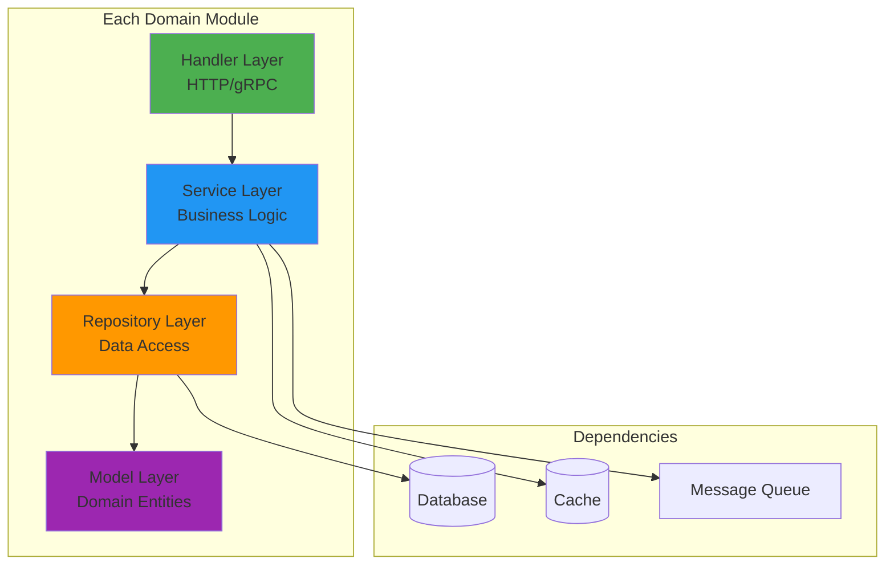

---

## 🚀 Getting Started

### Prerequisites

- Go 1.22 or higher
- PostgreSQL 14+
- Redis 7+
- Docker & Docker Compose (optional)

### Installation

1. **Clone the repository**
   ```bash
   git clone https://github.com/yourusername/ticketing-backend.git
   cd ticketing-backend
   ```

2. **Install dependencies**
   ```bash
   go mod download
   ```

3. **Setup environment variables**
   ```bash
   cp .env.example .env
   # Edit .env with your configuration
   ```

4. **Start services with Docker**
   ```bash
   docker-compose up -d postgres redis kafka
   ```

5. **Run migrations**
   ```bash
   make migrate-up
   ```

6. **Seed database (optional)**
   ```bash
   go run scripts/seed.go
   ```

7. **Start the server**
   ```bash
   go run cmd/api/main.go
   ```

The API will be available at `http://localhost:8080`

### Environment Variables

```env
# Server
PORT=8080
ENV=development

# Database
DB_HOST=localhost
DB_PORT=5432
DB_USER=postgres
DB_PASSWORD=your_password
DB_NAME=ticket_booking

# Redis
REDIS_HOST=localhost
REDIS_PORT=6379
REDIS_PASSWORD=

# JWT
JWT_SECRET=your_jwt_secret
JWT_EXPIRY=24h
REFRESH_TOKEN_EXPIRY=168h

# OAuth
GOOGLE_CLIENT_ID=
GOOGLE_CLIENT_SECRET=
GOOGLE_REDIRECT_URL=

# Payments
PAYSTACK_SECRET_KEY=
STRIPE_SECRET_KEY=
WEBHOOK_SECRET=

# Kafka
KAFKA_BROKERS=localhost:9092

# S3
S3_BUCKET=
S3_REGION=
S3_ACCESS_KEY=
S3_SECRET_KEY=
```

---

## 🔒 Security

### Security Measures

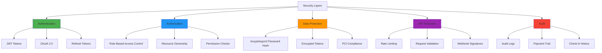

### Security Checklist

- ✅ Password hashing with bcrypt/argon2
- ✅ JWT with short expiry + refresh tokens
- ✅ Rate limiting on all endpoints
- ✅ RBAC (Role-Based Access Control)
- ✅ Webhook signature verification
- ✅ SQL injection prevention (ORM)
- ✅ XSS protection
- ✅ CORS configuration
- ✅ Audit logging for sensitive operations
- ✅ PCI DSS compliance for payments

---

## ⚡ Performance

### Performance Targets

| Metric | Target | Strategy |
|--------|--------|----------|
| **API Response Time** | < 200ms | Caching, indexing, connection pooling |
| **Uptime** | 99.9% | Load balancing, health checks, auto-scaling |
| **Concurrent Users** | 10,000+ | Horizontal scaling, event-driven architecture |
| **Database Queries** | < 50ms | Proper indexing, query optimization |
| **Cache Hit Rate** | > 80% | Redis caching strategy |

### Caching Strategy

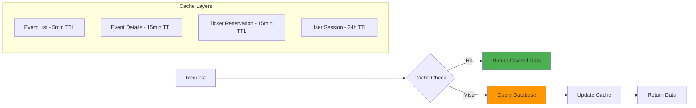

### Observability

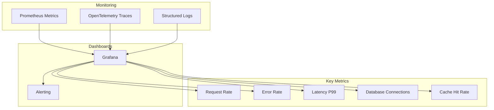

---

## 🎯 Success Metrics

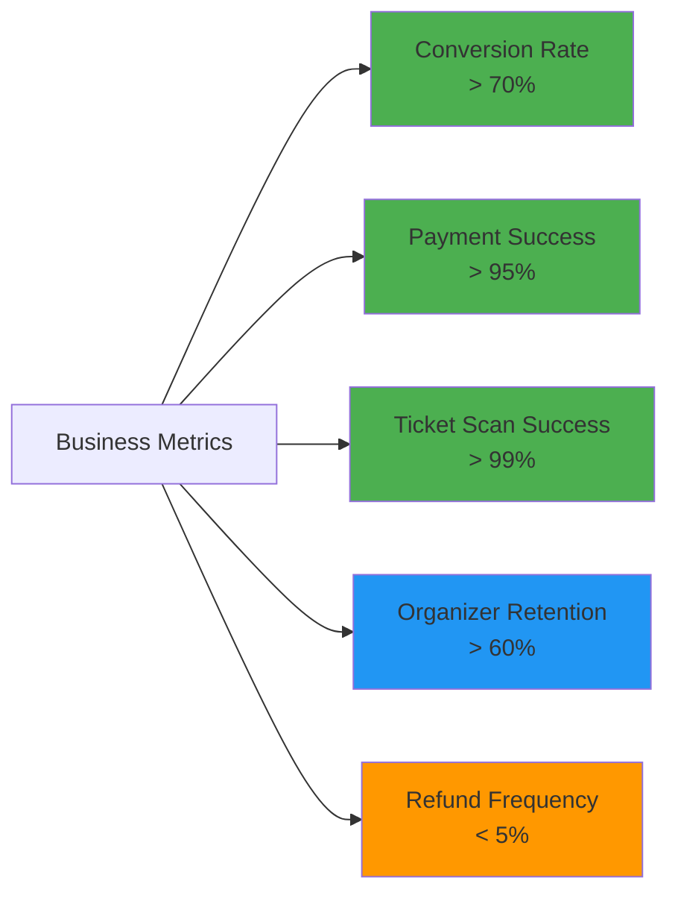

---

## 📝 Future Roadmap

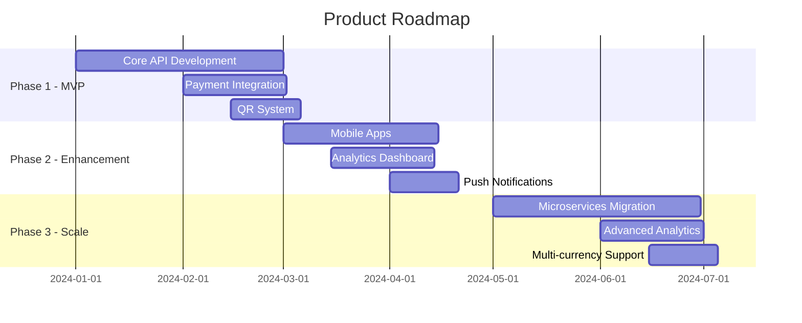

---

## 🤝 Contributing

Contributions are welcome! Please follow these steps:

1. Fork the repository
2. Create a feature branch (`git checkout -b feature/amazing-feature`)
3. Commit your changes (`git commit -m 'Add amazing feature'`)
4. Push to the branch (`git push origin feature/amazing-feature`)
5. Open a Pull Request

---

## 📄 License

This project is licensed under the MIT License - see the [LICENSE](LICENSE) file for details.

---

## 📧 Contact

For questions or support, please contact:
- **Email**: support@eventix.com
- **Website**: https://eventix.com
- **Documentation**: https://docs.eventix.com

---

<div align="center">
  <p>© 2025 Eventix. All rights reserved.</p>
</div>
